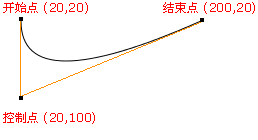
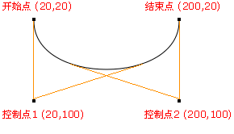

[TOC]
# Canvas

## canvas简介
- 是HTML5提供的一种新标签
- 是一个矩形区域的画布，可以用JavaScript在上面绘画，控制其每一个像素，本身不具备绘图功能。
- 拥有多种绘制路径、矩形、圆形、字符以及添加图像的方法。

使用：
```
<canvas width="600" height="600">你的浏览器不支持canvas，请升级浏览器</canvas>
```

## canvas用途
- 游戏：canvas在基于Web的图像显示方面比Flash更加立体、更加精巧，canvas游戏在流畅度和跨平台方面更牛。
- 可视化数据.数据图表话，比如:百度的echart
- banner广告：Flash曾经辉煌的时代，智能手机还未曾出现。现在以及未来的智能机时代，HTML5技术能够在banner广告上发挥巨大作用，用Canvas实现动态的广告效果再合适不过。

### canvas标签语法和属性
1. 可以设置width和height属性，但是属性值单位必须是px，否则忽略，默认300*150px
2. 不要用CSS控制它的宽和高,会造成图片拉伸，
3. js重新设置canvas标签的宽高属性会让画布擦除所有的内容。
4. 可以给canvas画布设置背景色


### canvas坐标系
canvas坐标系，从最左上角0,0开始。x向右增大， y向下增大


## Canvas API

### 绘图上下文context
上下文：工具包，是所有的绘制操作api的入口或者集合

1. canvas自身无法绘制任何内容。Canvas的绘图是使用JavaScript操作的。
2. context对象就是JavaScript操作Canvas的接口
3. 使用getContext('2d')来获取2D绘图上下文。

```js
    var canvas = document.querySelector('canvas');
    var ctx = canvas.getContext('2d');  //注意：2d小写， 3d：webgl
```

### 绘制图形
#### 属性
* lineWidth     设置线宽
* strokeStyle   设置描边样式（默认黑色）
* fillStyle     设置填充样式（默认黑色）

#### 方法
* moveTo(x,y)   设置绘制路径的起点（移动画笔位置）
* lineTo(x,y)   画线
* closePath()   闭合路径，必须闭合路径才能成功填充
* beginPath()   开启一个新状态，基于之前的状态开启新的状态，新的状态会保持之前的设置
    ```js
    ctx.beginPath();
    //开启新的状态后，当设置新的值时，只会作用于当前状态，不会影响之前的状态
    ctx.lindeWidth = 2;
    ctx.strokeStyle = '# ddd';
    ```

* rect(x,y,width,height) 绘制矩形路径
x, y是矩形左上角坐标， width和height都是以像素计（下同）
>PS: rect方法只是规划了矩形的路径，并没有填充和描边

* strokeRect(x,y,width,height)  绘制描边矩形
* fillRect(x,y,width,height)    绘制填充矩形
* stroke()      描边
* fill()        填充，该方法会自动闭合路径
* clearRect(x,y,width,height)   清除矩形区域，
>PS:重新设置canvas的宽/高也能达到清空的效果

* arc(x,y,radius,startAngle,endAngle,counterclockwise)   画圆弧/画圆
    - x,y：圆心坐标。
    - radius：半径大小。
    - startAngle:绘制开始的角度（x轴为0度）。 
    - endAngel:结束的角度，注意是弧度。
    - counterclockwise：是否是逆时针。true是逆时针，false：顺时针

```
弧度和角度的转换公式： rad = deg*Math.PI/180;
在Math提供的方法中sin、cos等都使用的弧度 
```


**绘图步骤（5步）：
```js
    1、获得画布
    var canvas  = document.getElementById( 'cavsElem' );

    2、获得canvas上下文
    var ctx = canvas.getContext( '2d' ); 

    3、绘制路径
    //设置绘制起点（移动画笔位置）
    ctx.moveTo(100,100);

    ctx.lineTo(200,100);
    ctx.lineTo(100,200);

    4、设置样式
    //设置线宽
    ctx.lineWidth = 4;

    //设置描边样式（默认黑色）
    ctx.strokeStyle = 'red';

    //设置填充样式（默认黑色）
    ctx.fillStyle = '# f60';

    5、描边/填充
    ctx.stroke();
    ctx.fill();

    PS：fill()方法会自动闭合路径
```

### 绘制字体（了解）
#### 属性
* font      设置或返回文本内容的当前字体属性，语法与CSS相同
* textAlign 设置或返回文本内容的当前对齐方式
    - start（默认）: 文本在指定的位置开始。
    - end : 文本在指定的位置结束。
    - center: 文本的中心被放置在指定的位置。
    - left : 文本左对齐。
    - right : 文本右对齐。

    

* textBaseline 设置或返回在绘制文本时使用的当前文本基线
    - alphabetic ： 默认。文本基线是普通的字母基线。
    - top ： 文本基线是 em 方框的顶端。。
    - hanging ： 文本基线是悬挂基线。
    - middle ： 文本基线是 em 方框的正中。
    - ideographic： 文本基线是em基线。
    - bottom ： 文本基线是 em 方框的底端

    

#### 方法
* fillText(text,x,y)    填充字体
* strokeText(text,x,y)  描边字体
* measureText(text) 检测字体宽度,返回包含指定文本宽度的对象
    * text:文本
    * x,y：绘制文字起始坐标


### 绘制图片
* 基本绘制图片的方式

```js
    ctx.drawImage(img,x,y);
    参数：
    x,y 绘制图片左上角的坐标，
    img是绘制图片的dom对象。
```

* 在画布上绘制图像，并规定图像的宽度和高度

```js
    ctx.drawImage(img,x,y,width,height);   
    参数：
    width 绘制图片的宽度， 
    height：绘制图片的高度

    如果指定宽高，最好成比例，不然图片会被拉伸
    等比公式： height = 原高度*width/原宽度;
```

* 图片裁剪，并把裁剪完成后的那部分图片绘制到画布上

```js
    ctx.drawImage(img,sx,sy,swidth,sheight,x,y,width,height);
    参数：
    sx,sy 裁剪的左上角坐标，
    swidth：裁剪图片的宽度。
    sheight:裁剪的高度
```

### 设置阴影（了解）
* shadowColor ： 设置或返回用于阴影的颜色
* shadowBlur ： 设置或返回用于阴影的模糊级别,数值越高，模糊程度越大 （默认为0，不模糊）
* shadowOffsetX： 设置或返回阴影距形状的水平距离
* shadowOffsetY： 设置或返回阴影距形状的垂直距离

示例：
```js
    ctx.fillStyle = '# fc0';
    ctx.shadowColor = '# 333';
    ctx.shadowBlur = 50;
    ctx.shadowOffsetX = 5;
    ctx.shadowOffsetY = 5;
    ctx.fillRect(100,100,100,100);
```

### 创建渐变样式（了解）

#### 线性渐变
线性渐变是一个对象

* 语法：ctx.createLinearGradient(x0,y0,x1,y1);
参数：x0,y0起始坐标，x1,y1结束坐标

* addColorStop(stop,color)
    - stop：介于 0.0 与 1.0 之间的值，表示渐变中开始与结束之间的位置
    - color：颜色值

```js
    //创建线性渐变的对象，
    var grd=ctx.createLinearGradient(0,0,170,0);

    //添加一个渐变颜色，
    //参数1：0.0 与 1.0 之间的值，表示渐变中开始与结束之间的位置。
    //参数2：具体颜色
    grd.addColorStop(0,"black");

    //添加一个渐变颜色
    grd.addColorStop(1,"white");

    //关键点，把渐变设置到 填充的样式
    ctx.fillStyle =grd;
```

#### 径向渐变   
* ctx.createRadialGradient(x0,y0,r0,x1,y1,r1);
    - x0: 渐变的开始圆的 x 坐标
    - y0: 渐变的开始圆的 y 坐标
    - r0: 开始圆的半径
    - x1: 渐变的结束圆的 x 坐标
    - y1: 渐变的结束圆的 y 坐标
    - r1: 结束圆的半径

```js
    var rlg = ctx.createRadialGradient(300,300,10,300,300,200);

    //添加一个渐变颜色
    rlg.addColorStop(0, '# ccc');
    rlg.addColorStop(.4, '# efefef');
    rlg.addColorStop(1, '# fff');

    //设置 填充样式为延续渐变的样式
    ctx.fillStyle = rlg;
    ctx.fillRect(100, 100, 500, 500);
```


### 绘制背景图（了解）
ctx.createPattern(img,repeat) 方法在指定的方向内重复指定的元素了解

* 参数一：设置平铺背景的图片的DOM节点，
* 参数二：背景平铺的方式。
    - image ： 规定要使用的图片、画布或视频元素。
    - repeat ： 默认。该模式在水平和垂直方向重复。
    - repeat-x ： 该模式只在水平方向重复。
    - repeat-y ： 该模式只在垂直方向重复。
    - no-repeat： 该模式只显示一次（不重复）。

```js
    var ctx=c.getContext("2d");
    var img=document.getElementById("lamp");
    var pat=ctx.createPattern(img,"repeat");
    ctx.rect(0,0,150,100);
    ctx.fillStyle=pat;//  把背景图设置给填充的样式
    ctx.fill();
```


### 画布变换
>注意：画布变换仅仅是改变画布状态，不会影响之前画布上的内容

* 缩放
scale(scaleWidth,scaleHeight) 方法缩放当前绘图，参数为0~1的值

* 位移画布
translate(x,y) 方法重新映射画布上的 (0,0) 位置

* 旋转
rotate(radian) 方法旋转当前的绘图，注意参数是弧度


### 绘制环境保存和还原
* ctx.save() 保存当前环境的状态
可以把当前绘制环境context保存到缓存中。

* ctx.restore() 返回之前保存过的路径状态和属性
获取最近通过save()方法缓存的context


### 保存base64编码图片
* toDataURL(type, encoderOptions);
    - type，设置输出的类型，比如 image/png image/jpeg等
    - encoderOptions：0-1之间的数字，用于标识输出图片的品质

>PS:必须在服务器环境下使用

```js
    var canvas = document.getElementById("canvas");
    var dataURL = canvas.toDataURL();
    var img = document.querySelector("img");
    img.src = canvas.toDataURL("image/png");//将画布的内容赋值给图片的src属性
```


### 贝塞尔曲线（了解）

#### 二次方曲线
quadraticCurveTo(cpx,cpy,x,y)

* cpx： 贝塞尔控制点的 x 坐标
* cpy： 贝塞尔控制点的 y 坐标
* x ： 结束点的 x 坐标
* y ： 结束点的 y 坐标 


#### 贝塞尔曲线
bezierCurveTo(cp1x,cp1y,cp2x,cp2y,x,y)
>提示：三次贝塞尔曲线需要三个点。前两个点是用于三次贝塞尔计算中的控制点，第三个点是曲线的结束点

* cp1x： 第一个贝塞尔控制点的 x 坐标
* cp1y： 第一个贝塞尔控制点的 y 坐标
* cp2x： 第二个贝塞尔控制点的 x 坐标
* cp2y： 第二个贝塞尔控制点的 y 坐标
* x: 结束点的 x 坐标
* y: 结束点的 y 坐标



## Canvas应用
* Echarts
* Highcharts